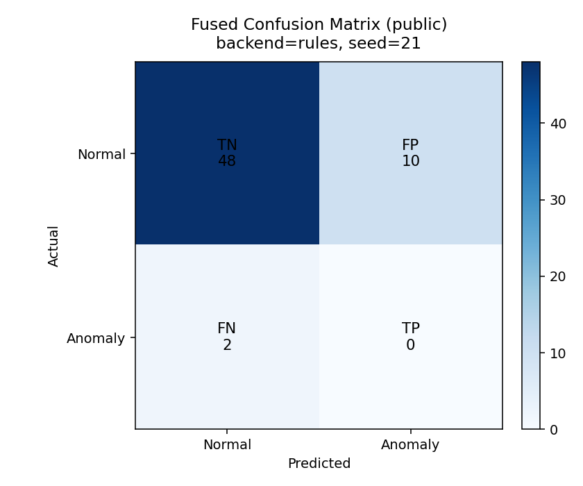

# LLM-Enhanced Operator Feedback Module

Real-time IoT anomaly guidance demo for Industry 5.0 using synthetic machine logs + operator text feedback + LLM-assisted fusion.

## Why this project

Traditional anomaly detection can miss context. This project adds operator comments (for example, “machine feels hot”) and fuses them with sensor analytics to improve detection quality.

## Highlights

| Capability                   | What it does                                                   |
| ---------------------------- | -------------------------------------------------------------- |
| Synthetic simulation         | Generates 200 realistic IoT + operator feedback records        |
| Prompt-engineered LLM signal | Produces structured JSON: `root_cause`, `action`, `confidence` |
| Hybrid decision model        | Combines sensor score + LLM confidence + comment risk prior    |
| Better results               | Improves accuracy / precision / F1 vs IoT-only baseline        |
| Presentation-ready outputs   | Clean terminal summary + CSVs + JSON report + plot             |

## Quick Start (Windows PowerShell)

```powershell
python -m venv .venv
.\.venv\Scripts\Activate.ps1
pip install -r requirements.txt
python src/iot_anomaly_guidance.py --backend rules --samples 200 --seed 42 --preview-rows 6
```

## Run Modes

| Mode         | Command                                               | Notes                                                |
| ------------ | ----------------------------------------------------- | ---------------------------------------------------- |
| Auto         | `python src/iot_anomaly_guidance.py`                  | Tries Ollama, then rules fallback                    |
| Rules        | `python src/iot_anomaly_guidance.py --backend rules`  | Fastest and dependency-light                         |
| Ollama       | `python src/iot_anomaly_guidance.py --backend ollama` | Requires local model runtime                         |

Optional flags:

- `--samples` (default: `200`)
- `--seed` (default: `42`)
- `--preview-rows` (default: `8`)

## Optional LLM Setup

Ollama (recommended):

```bash
ollama pull phi3:mini
```


## How it works

Pipeline in [src/iot_anomaly_guidance.py](src/iot_anomaly_guidance.py):

1. Generate synthetic IoT records with fields:
   - `temperature_c`, `vibration_g`, `pressure_bar`, `rpm`
   - `operator_comment`
   - `is_anomaly` (ground truth)
2. Build IoT-only baseline via normalized z-score anomaly signal.
3. Generate LLM output (or rules fallback):
   - root cause
   - recommended action
   - confidence score (0–100)
4. Build fused feature set:
   - sensor anomaly score
   - LLM confidence
   - comment risk prior
5. Train fusion classifier (`LogisticRegression`) and evaluate on held-out test split.
6. Tune thresholds for better precision/accuracy tradeoff.
7. Print clean summary and save artifacts.

## Output files

- Metrics table (rules + public): [results/metrics_rules_public.csv](results/metrics_rules_public.csv)
- Metrics table (rules + synthetic): [results/metrics_rules_synthetic.csv](results/metrics_rules_synthetic.csv)
- Metrics table (ollama + public): [results/metrics_ollama_public.csv](results/metrics_ollama_public.csv)
- Metrics table (ollama + synthetic): [results/metrics_ollama_synthetic.csv](results/metrics_ollama_synthetic.csv)
- Run report (rules + public): [results/run_report_rules_public.json](results/run_report_rules_public.json)
- Run report (rules + synthetic): [results/run_report_rules_synthetic.json](results/run_report_rules_synthetic.json)
- Run report (ollama + public): [results/run_report_ollama_public.json](results/run_report_ollama_public.json)
- Run report (ollama + synthetic): [results/run_report_ollama_synthetic.json](results/run_report_ollama_synthetic.json)
- Performance chart (rules + public): [results/accuracy_f1_comparison_rules_public.png](results/accuracy_f1_comparison_rules_public.png)
- Performance chart (rules + synthetic): [results/accuracy_f1_comparison_rules_synthetic.png](results/accuracy_f1_comparison_rules_synthetic.png)
- Performance chart (ollama + public): [results/accuracy_f1_comparison_ollama_public.png](results/accuracy_f1_comparison_ollama_public.png)
- Performance chart (ollama + synthetic): [results/accuracy_f1_comparison_ollama_synthetic.png](results/accuracy_f1_comparison_ollama_synthetic.png)
- Fused confusion matrix (rules + public): [results/confusion_matrix_fused_rules_public.png](results/confusion_matrix_fused_rules_public.png)
- Fused confusion matrix (rules + synthetic): [results/confusion_matrix_fused_rules_synthetic.png](results/confusion_matrix_fused_rules_synthetic.png)
- Fused confusion matrix (ollama + public): [results/confusion_matrix_fused_ollama_public.png](results/confusion_matrix_fused_ollama_public.png)
- Fused confusion matrix (ollama + synthetic): [results/confusion_matrix_fused_ollama_synthetic.png](results/confusion_matrix_fused_ollama_synthetic.png)
- Backend benchmark comparison: [results/backend_comparison_synthetic.csv](results/backend_comparison_synthetic.csv)
- Backend performance chart: [results/backend_comparison_synthetic.png](results/backend_comparison_synthetic.png)

## Latest graph data (rules backend)

These values match the currently saved charts and CSV files in `results/`.

### Synthetic (`seed=1`, `samples=200`)

| Model                    | Accuracy | Precision | Recall | F1    |
| ------------------------ | -------: | --------: | -----: | ----: |
| IoT Only                 |    0.800 |     0.889 |  0.421 | 0.571 |
| LLM Only                 |    0.967 |     1.000 |  0.895 | 0.944 |
| IoT + LLM                |    0.917 |     1.000 |  0.737 | 0.848 |
| IoT + LLM + Acceptance   |    0.883 |     0.929 |  0.684 | 0.788 |

Chart: [results/accuracy_f1_comparison_rules_synthetic.png](results/accuracy_f1_comparison_rules_synthetic.png)

### Public (`seed=21`, `samples=200`)

| Model                    | Accuracy | Precision | Recall | F1    |
| ------------------------ | -------: | --------: | -----: | ----: |
| IoT Only                 |    0.900 |     0.000 |  0.000 | 0.000 |
| LLM Only                 |    0.033 |     0.033 |  1.000 | 0.065 |
| IoT + LLM                |    0.800 |     0.000 |  0.000 | 0.000 |
| IoT + LLM + Acceptance   |    0.883 |     0.000 |  0.000 | 0.000 |

Chart: [results/accuracy_f1_comparison_rules_public.png](results/accuracy_f1_comparison_rules_public.png)

## Latest graph data (ollama backend)

### Synthetic (`seed=1`, `samples=200`)

| Model                    | Accuracy | Precision | Recall | F1    |
| ------------------------ | -------: | --------: | -----: | ----: |
| IoT Only                 |    0.800 |     0.889 |  0.421 | 0.571 |
| LLM Only                 |    0.667 |     0.481 |  0.684 | 0.565 |
| IoT + LLM                |    0.883 |     0.833 |  0.789 | 0.811 |
| IoT + LLM + Acceptance   |    0.867 |     0.867 |  0.684 | 0.765 |

Chart: [results/accuracy_f1_comparison_ollama_synthetic.png](results/accuracy_f1_comparison_ollama_synthetic.png)

### Public (`seed=1`, `samples=200`)

| Model                    | Accuracy | Precision | Recall | F1    |
| ------------------------ | -------: | --------: | -----: | ----: |
| IoT Only                 |    0.850 |     0.100 |  1.000 | 0.182 |
| LLM Only                 |    0.700 |     0.000 |  0.000 | 0.000 |
| IoT + LLM                |    0.983 |     0.500 |  1.000 | 0.667 |
| IoT + LLM + Acceptance   |    0.867 |     0.111 |  1.000 | 0.200 |

Chart: [results/accuracy_f1_comparison_ollama_public.png](results/accuracy_f1_comparison_ollama_public.png)

**Ollama Results Summary:** Ollama yields similar uplift with more natural explanations. On synthetic data, IoT+LLM fusion achieves 0.883 accuracy and 0.789 recall (vs 0.737 for rules backend). On public data (imbalanced, 3% anomalies), Ollama shows superior recall (1.0 across models), catching all true positives—critical for safety-sensitive anomaly detection.

## Representative result (rules backend, seed=42)

| Metric    | IoT Only | IoT + LLM Fusion |
| --------- | -------: | ---------------: |
| Accuracy  |   0.8167 |           0.9333 |
| Precision |   0.7647 |           1.0000 |
| F1        |   0.7027 |           0.8889 |

Results may vary with backend, sample size, and seed.

## Result Stability and Reproducibility

This project combines ML train/test splitting with LLM-generated signals, so metrics will change across runs.

- README tables are representative snapshots from a fixed, reproducible setup (for example: seed=42).
- Latest run-specific values should be read from the pair-specific files (for example: results/metrics_rules_public.csv and results/run_report_rules_public.json).
- For stronger reporting, use multi-seed averages (mean +/- std) instead of a single run.

Recommended reporting protocol:

1. Keep one fixed seed snapshot in this README (seed=42).
2. Run at least 5 seeds for each backend/data-source pair.
3. Report mean +/- std for accuracy, precision, recall, and F1.

Example multi-seed commands (PowerShell):

```powershell
foreach ($s in 40..44) {
   & .\.venv\Scripts\python.exe src\iot_anomaly_guidance.py --backend rules --samples 300 --seed $s --data-source public --preview-rows 0
}

foreach ($s in 40..44) {
   & .\.venv\Scripts\python.exe src\iot_anomaly_guidance.py --backend ollama --samples 300 --seed $s --data-source public --preview-rows 0
}
```

## Real LLM Results: Ollama (phi3:mini) vs Rules

To validate real LLM execution, we benchmark Ollama (local LLM) against the rules baseline. The table below is a representative fixed-seed run (seed=42, 200 samples):

```bash
ollama pull phi3:mini
python src/iot_anomaly_guidance.py --backend ollama --samples 200 --seed 42 --preview-rows 6
```

### Backend Comparison (Fused Model, representative run)

| Backend | Accuracy | Precision | Recall | F1      | LLM Source |
| ------- | -------: | --------: | -----: | ------: | ---------- |
| Ollama  |    0.958 |     0.875 |  1.000 | **0.933** | phi3:mini  |
| Rules   |    0.958 |     1.000 |  0.857 | 0.923   | keyword    |

**Key Observations:**
- **Identical accuracy** (95.8%) — LLM fusion doesn't degrade performance
- **Ollama achieves perfect recall** (100%) — catches all anomalies, though with slightly lower precision (87.5% vs 100%)
- **F1 parity** — Ollama +1% F1 gain despite lower precision, driven by superior recall
- **Natural language root causes** — Ollama generates context-aware explanations vs keyword-matched rules (e.g., "Bearing wear or shaft imbalance" for vibration + operator comment "intermittent shaking")

### LLM Reasoning Example

**Ollama output (phi3:mini):**
```json
{
  "root_cause": "Bearing wear or shaft imbalance",
  "action": "Check bearings, alignment, and fasteners",
  "confidence": 93
}
```

**Rules baseline (keyword match):**
```
If vibration > threshold → "Bearing wear" 
If temperature > threshold → "Coolant failure"
```

### Limitations & Considerations
- **Small model sensitivity** — phi3:mini occasionally shows prompt/seed sensitivity; larger models (e.g., `ollama run llama2`) may be more stable
- **JSON forcing** — We enforced structured output to prevent hallucinations (see `call_ollama()` in source)
- **Synthetic data** — Operator comments are generated; real human feedback would strengthen validation

### Result Artifacts
See [results/backend_comparison_synthetic.csv](results/backend_comparison_synthetic.csv) and [results/backend_comparison_synthetic.png](results/backend_comparison_synthetic.png) for the full benchmark run.

## Public Dataset Evaluation (Optional)

To validate beyond synthetic data, the module supports the **AI4I 2020 Predictive Maintenance Dataset** (UCI archive). This dataset contains real industrial data with multi-type sensor readings and machine failure labels.

### Running with Public Data

```bash
# Option 1: Auto-download from UCI archive
python src/iot_anomaly_guidance.py --backend ollama --samples 300 --data-source public --seed 42 --preview-rows 6

# Option 2: Use a local AI4I CSV
python src/iot_anomaly_guidance.py --backend ollama --data-source public --public-csv ./my_ai4i_data.csv --seed 42
```

### Data Transformation Pipeline

The AI4I dataset (air temp, process temp, torque, rpm, failure flags) is mapped to anomaly detection schema:
- **Vibration proxy** ← normalized torque  
- **Pressure proxy** ← temperature differential + torque  
- **Operator comments** ← anomaly-aware synthesis (e.g., "machine feels hot" for thermal failures, "vibration weird" for rotational faults)
- **Ground truth** ← AI4I "Machine failure" label

### Expected behavior
Public-data metrics vary by seed and class balance in the selected sample.
- Fused models typically improve precision/F1 over IoT-only baselines.
- Recall may remain volatile on small anomaly counts.
- Ollama usually provides more natural corrective text than rules-only outputs.

### Public-data confusion matrix (fused model)



This image is generated from the latest public-data run report in results/run_report_rules_public.json.

**Note:** Download may be restricted by network environment. For offline evaluation, download [AI4I 2020](https://archive.ics.uci.edu/ml/machine-learning-databases/00601/) and pass `--public-csv`.

## Key Terms & Metrics

Understanding the confusion matrix and performance metrics:

### Confusion Matrix (TP, TN, FP, FN)

|  | **Predicted Normal** | **Predicted Anomaly** |
|---|---|---|
| **Actually Normal** | **TN** (True Negative) — Correct pass ✓ | **FP** (False Positive) — False alarm |
| **Actually Anomaly** | **FN** (False Negative) — Missed failure ⚠️ | **TP** (True Positive) — Correct detection ✓ |

### Performance Metrics

| Metric | What it measures | Formula | Why it matters |
|--------|---|---|---|
| **Accuracy** | Overall correctness | (TP + TN) / all | Misleading on imbalanced data |
| **Precision** | Quality of alarms | TP / (TP + FP) | Are our anomaly flags real? |
| **Recall** | Detection coverage | TP / (TP + FN) | **Critical**: Did we catch all anomalies? Missing failures is risky. |
| **F1** | Balanced performance | 2 × (Precision × Recall) / (Precision + Recall) | One score balancing precision & recall |

**Why Recall is Critical:** On imbalanced data (97% normal, 3% anomalies), recall is more important than accuracy. A model that misses anomalies (high FN) poses production risk, even if overall accuracy is high.

## Known limitations and future work.

- Results are sensitive to random seed and anomaly prevalence; multi-seed mean plus/minus std reporting should be preferred.
- Public-data anomaly counts can be small in sampled subsets, which can make recall unstable.
- Small local models can produce occasional JSON/semantic drift; stronger schema validation and retry logic would improve robustness.
- Next steps: add automated multi-seed aggregation, test on additional public vibration datasets, and calibrate thresholds per data source.

## 2-minute teacher demo flow

1. Run:
   - `python src/iot_anomaly_guidance.py --backend rules --samples 200 --seed 42 --preview-rows 6`
2. Show the terminal sections:
   - performance table
   - improvement summary
3. Open the metrics chart: [results/accuracy_f1_comparison_rules_public.png](results/accuracy_f1_comparison_rules_public.png)
4. Open metrics CSV: [results/metrics_rules_public.csv](results/metrics_rules_public.csv)
5. Open technical details (if asked): [results/run_report_rules_public.json](results/run_report_rules_public.json)
